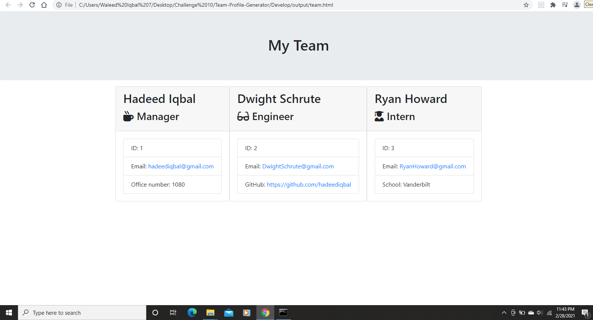

# Employee profile HTML page generator

## Description

A Node CLI that takes in information about emplyees and generates and HTML webpage that displays summaries for each person.

## Screenshot

## Testing

Unit test with Jest

## Usage

Download or clone the repo and run it with node app.js in your terminal

Code Source: https://youtu.be/3uBMLj_Od8I
